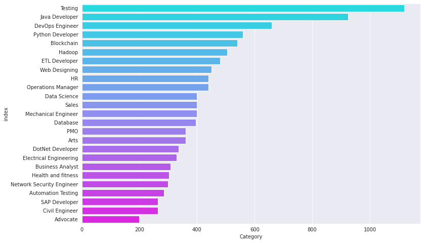
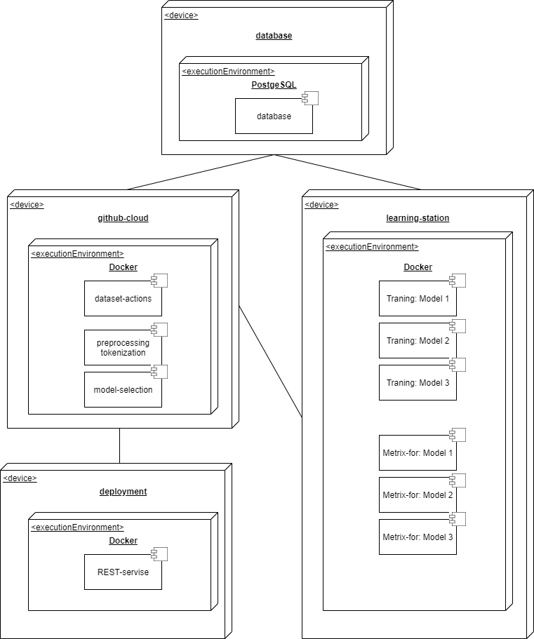

# Система автоматического сканирования резюме
-------------
### Авторы
* Вячеслав Гораш (P4140)
* Екатерина Машина (P4141)

#### Цель 
Автоматизировать процесс поиска новых сотрудников в компанию: увеличить скорость "сканирования" резюме кандидатов за счет автоматической кластеризации поступающих резюме по вакансиям в компании.

#### Задачи
1. анализ существующих решений;
2. оценка релевантности найденного датасета для решения поставленных задач;
3. выбор архитектур моделей для решения поставленной задачи;
4. оценка качества моделей исходя из метрик: `precision`, `recall`, `f1-score` и `Accuracy`;
5. оценка времени работы модели;
6. выбор лучшей модели исходя из её показателей качества и скорости работы;
7. развертывание выбранной модели

#### Датасет
 [Curriculum Vitae](https://www.kaggle.com/datasets/leenardeshmukh/curriculum-vitae)

Пример данных

|      |     Category | Resume                                            |
| ---: | -----------: | ------------------------------------------------- |
|    0 | Data Science | Skills * Programming Languages: Python (pandas... |
|    1 | Data Science | Education Details \r\nMay 2013 to May 2017 B.E... |
|    2 | Data Science | Areas of Interest Deep Learning, Control Syste... |
|    3 | Data Science | Skills • R • Python • SAP HANA • Table...     |
|    4 | Data Science | Education Details \r\n MCA YMCAUST, Faridab...    |

Рисунок 1. Распределение вакансий по позициям

Рисунок 2. Распределение вакансий по позициям в процентах

#### Целесообразность выбора датасета

Целесообразность использования датасета для решения поставленной задачи: 
- Датасет имеет достаточный объем для обучения модели классификации.
- Датасет имеет достаточно большое разнообразие вакансий на которые были поданы резюме (распределение вакансий представлено на рисунках 1 и 2).  
- Тексты резюме представлены в свободной форме. что приближает набор данных к реальным данным. которые будут использоваться при использовании модели.

#### [Ссылка на репозитрий проекта](https://github.com/mashinakatherina/curriculum-vitae-screening)

#### Deploy diagram

#### Workflow diagram

