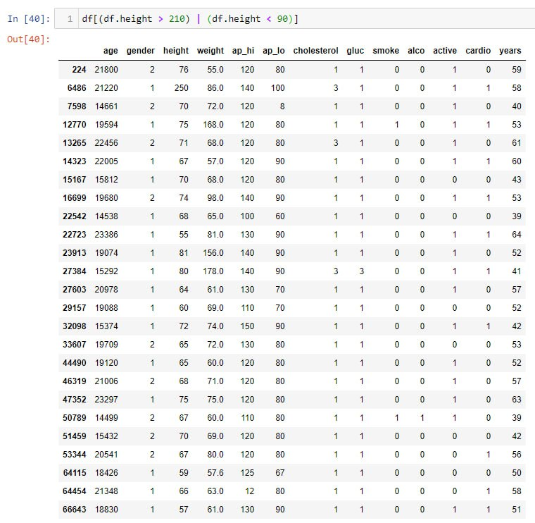
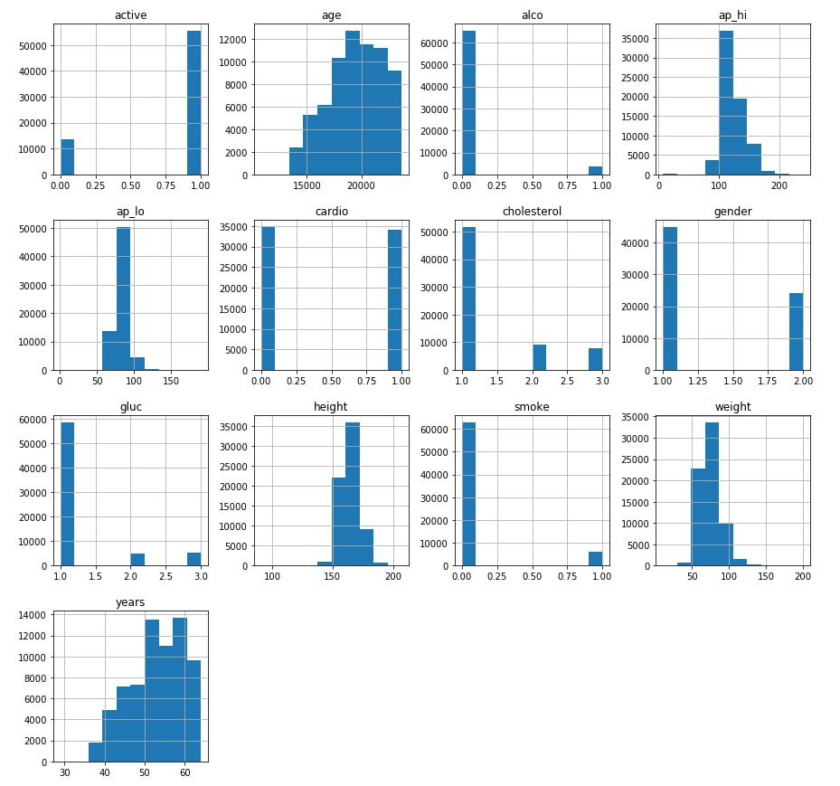
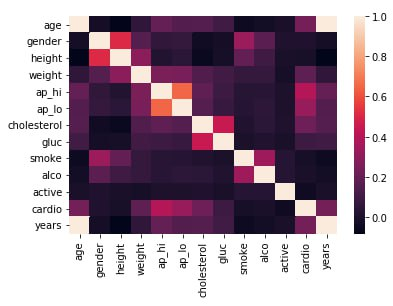
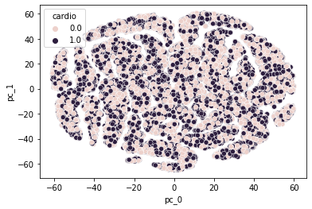

## heart-disease-risk

### Репозиторий

https://github.com/PavelEfarinov/a-ai-heart-disease-risk

### Цель

Автоматизация определения вероятности возникновения сердечно-сосудистого заболевания

Задачи:
1.	Разработка архитектуры системы.
2.	Подготовка исходных данных.
3.	Анализ существующих подходов. Выбор метрик валидации и обучения моделей.
4.	Обучение и оценка моделей на исходном датасете.
5.	Выбор оптимальной модели.
6.	Размещение и обновление модели.

### Данные

https://www.kaggle.com/datasets/thedevastator/exploring-risk-factors-for-cardiovascular-diseas

### Целесообразность использования датасета:

В ходе анализа датасета были обнаружены выбросы

- Есть несколько человек с аномально большим и малым ростом
- Есть несколько человек с отрицательным показателем артериального давления 

После удаления выбросов из 70к осталось 68960 строк

По матрице корреляции видно, что таргетная колонка имеет слабую корреляцию с показателями артериального давления и холестерина

Преобразование данных по TSNE не показало наличие кластеров

