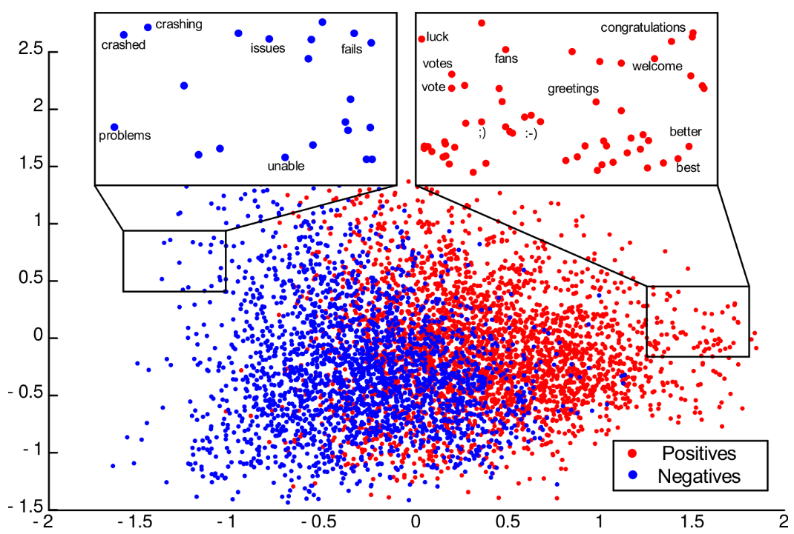

# 1. Определение границ проекта

Цель: Выполнить оценку эмоциональной окраски комментариев на Youtube. (повысить “точность” оценки эмоциональной окраски комментариев на Youtube).  

Задачи: 
1. анализ существующих решений;
1. сбор данных и их обновление;
1. обучение и оценка моделей на исходном датасете;
1. выбор двух моделей с наибольшим значением точности;
1. оценка качества и скорости работы модели на новых комментариях путем A / B тестирования;
1. выбор и развертывание наилучшей модели;
1. оптимизация выбранной модели путем квантизации и дистилляции;
1. развертывание оптимизированной модели, количественная оценка эффекта оптимизации.

Датасет: [текст и эмоциональная окраска 1000 комментариев на youtube](https://www.kaggle.com/datasets/advaypatil/youtube-statistics)  
Проект: [soy](https://github.com/foo/soy)  
Целесообразность использования датасета для решения поставленной задачи: по результатам векторизации отдельных слов текста комментариев и применения метода сокращения размерности на диаграмме отчетливо видны кластеры, задача разделения состоит в поиске оптимальной гиперплоскости (см. рис 2).

<figure>
    
    <figcaption>Рис 1. Диаграмма, демонстрирующая целесообразность решения задачи анализа данных на выбранном датасете методами машинного обучения</figcaption>
</figure>
