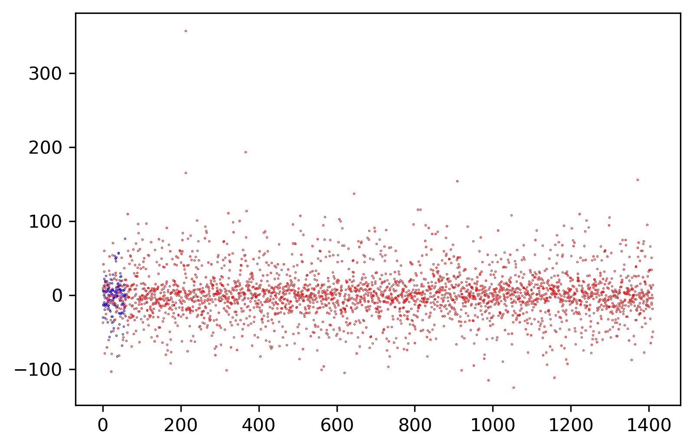

# Описание проекта
## Название проекта: wine-predictor
### Цель: Предсказать качество белого вина по его составу

# Репозиторий 

https://github.com/arskell/wine-predictor

Задачи:
1. Разработка архитектуры системы.
2. Подготовка исходных данных.
3. Обучение и оценка моделей на исходном датасете.
4. Выбор наиболее оптимальной модели.
5. Развертывание наилучшей модели.  

# Датасет

https://www.kaggle.com/datasets/shilongzhuang/red-and-white-wine-quality

# Целесообразность использования датасета

С использованием обученной модели можно предоставлять более качественные услуг гостиничного и ресторанного бизнеса. Достаточно иметь рассчитанный химический состав продукта

С помощью метода главных компонент можно увидеть распределение предикторов в двумерном пространстве. Красным выделено белое вино с высоким рейтингом (рейтинг больше 7), а все остальное - синим. Как можно увидеть, вино с низким качеством сильно разбросано, отличие от хорошего. С данным методом уже можно однозначно сказать, что существует возможность однозначно предсказать плохое вино с большой долей вероятности.

