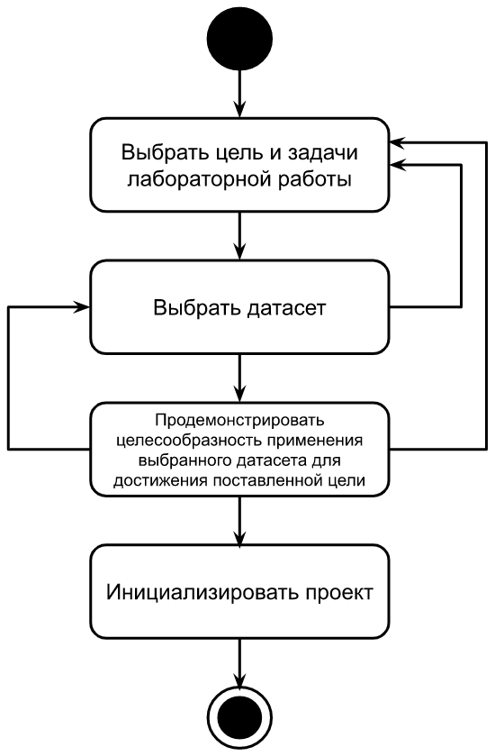

# 1. Определение границ проекта

Данная лабораторная работа направлена на приобретение навыков постановки цели и задач проекта, поиска, анализа и обработки данных.

## Задание

### Выбор предметной области

Прежде всего, в рамках первой лабораторной работы необходимо выбрать предметную область и сформулировать цель и задачи для практических заданий по данному курсу. При выборе предметной области допускается использовать один из двух подходов:
1. Проанализировать интересующую вас предметную область, сформулировать цель и задачи, далее перейти к поиску данных, которые позволят решить данную задачу;
1. Найти интересный датасет (см. далее) и отталкиваясь от него проанализировать предметную область и сформулировать соответствующие цели и задачи.

### Выбор датасета

При выборе датасета допускается использование одного из трех вариантов:
1. Рекомендация фильмов (заранее заданный [датасет](https://gist.githubusercontent.com/zeionara/de67f6c5ced7a7b04eac8d6556265e8e/raw/8aac306c985bd9e9e565fd97f4c6ea51c45a7d2c/ratings.csv)) - потенциально несложная модель, но требуется ручной анализ корпуса и привлечение дополнительных источников данных;
1. Анализ тональности комментариев на `YouTube` (заранее заданный [датасет](https://www.kaggle.com/datasets/advaypatil/youtube-statistics)) - потенциально сложная модель с точки зрения архитектуры и осуществляемых вычислений, но признаки формируются автоматически и дополнительных данных не требуется (допускается использование только текста комментариев);
1. Свой вариант (необходимо самостоятельно выбрать задачу и <tt label="Ресурс kaggle обеспечивает широкий выбор датасетов: https://www.kaggle.com/datasets" underlined>датасет</tt>).

### Демонстрация целесообразности использования выбранного датасета для достижения поставленной цели

Для выбранного датасета необходимо наглядно продемонстрировать целесообразность его использования для достижения поставленной цели методами машинного обучения. Рекомендуется:
1. При помощи гистограмм визуализировать распределение значений предикторов;
1. При помощи тепловых карт визуализировать коэффициенты корреляции между признаками исходных данных и целевой переменной (target variable);
1. Оценить сложность датасета, долю выбросов, долю отсутствующих данных (missing values) и оценить эффективность применения стратегий повышения качества исходных данных (data imputation, etc).

### Инициализация проекта

После выбора задачи и датасета необходимо инициализировать репозиторий с исходным кодом проекта:
1. Придумать название проекта, которое должно соответствовать требованиям конвенции наименования [kebab-case](https://www.theserverside.com/definition/Kebab-case);
1. Создать публичный репозиторий на сайте [github.com](https://github.com);
1. Создать директорию, название которой соответствует названию проекта, выбранному на шаге 1 в [каталоге с проектами репозитория данного курса](https://github.com/MANASLU8/ahri-source/tree/master/docs/project);
1. В директорию, созданную на предыдущем шаге, добавить файл `README.md` с кратким описанием проекта.

::: tip Примечание
Для выполнения шагов 3 и 4 инициализации проекта потребуется склонировать [репозиторий](https://github.com/MANASLU8/ahri-source), внести указанные изменения в локальную копию, сделать `pull request` и дождаться его принятия
:::

<figure>
    
    <figcaption>Рис 1. Диаграмма активностей процесса выполнения первой лабораторной работы</figcaption>
</figure>

На рис 1 приведена диаграмма активностей процесса выполнения лабораторной работы. В соответствии с данной диаграммой необходимо выполнить 4 шага, причем для успешного выполнения каждого из шагов (кроме последнего) может потребоваться выполнить несколько итераций и вернуться на предыдущие этапы вследствие возникновения следующих трудностей:
1. Отсутствие необходимого датасета  ;
1. Высокая сложность процесса сбора датасета;
1. Большой или малый объем выбранного датасета;
1. Нецелесообразность применения выбранного датасета для достижения поставленной цели;
1. Высокая вычислительная сложность алгоритмов обработки выбранного датасета.

## Критерии оценки
При оценке результатов лабораторной работы учитываются следующие характеристики предложенного решения:
1. Целесообразность применения методов машинного обучения для достижения поставленной цели;
1. Точность формулировки цели и задач обработки данных;
1. Практическая значимость цели разработки системы;
1. Наглядность демонстрации соответствия датасета поставленной задачи;
1. Объем выбранного датасета;
1. Точность и полнота ответов на вопросы преподавателя по содержанию лабораторной работы при ее защите.

**Результат выполнения лабораторной работы оценивается от {{ $themeConfig.variables.tasks[0].minScore }} до {{ $themeConfig.variables.tasks[0].maxScore }} баллов**.

## Пример

Цель: Повысить точность оценки эмоциональной окраски комментариев на Youtube.  
Задачи: 
1. анализ существующих решений;
1. сбор данных и их обновление;
1. обучение и оценка моделей на исходном датасете;
1. выбор двух моделей с наибольшим значением точности;
1. оценка качества и скорости работы модели на новых комментариях путем A / B тестирования;
1. выбор и развертывание наилучшей модели;
1. оптимизация выбранной модели путем квантизации и дистилляции;
1. развертывание оптимизированной модели, количественная оценка эффекта оптимизации.

Датасет: [текст и эмоциональная окраска 1000 комментариев на youtube](https://www.kaggle.com/datasets/advaypatil/youtube-statistics)  
Проект: [bar](https://github.com/foo/bar)  
Целесообразность использования датасета для решения поставленной задачи: по результатам векторизации отдельных слов текста комментариев и применения метода сокращения размерности на диаграмме отчетливо видны кластеры, задача разделения состоит в поиске оптимальной гиперплоскости (см. рис 2).

<figure>
    
    <figcaption>Рис 2. Пример диаграммы, демонстрирующей целесообразность решения задачи анализа данных на выбранном датасете методами машинного обучения</figcaption>
</figure>
