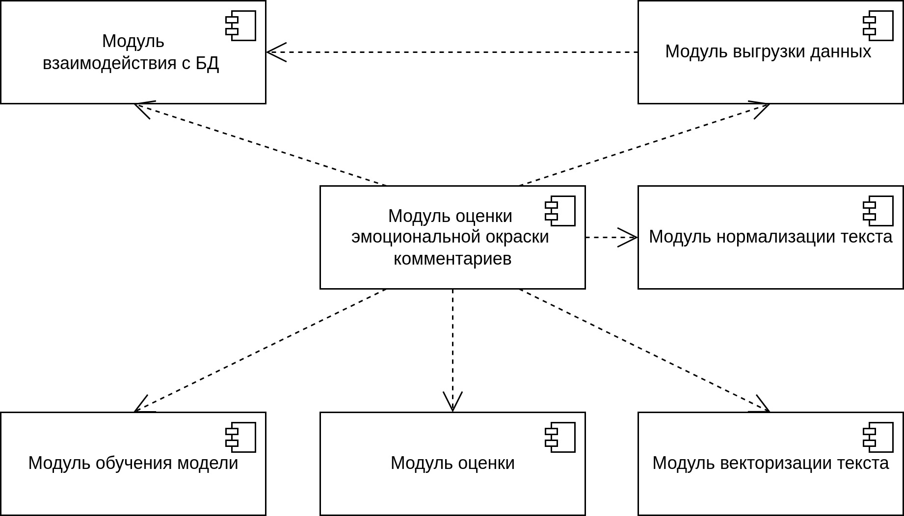

# 2. Разработка архитектуры системы

Данная лабораторная работа направлена на приобретение навыков разработки архитектуры системы искусственного интеллекта, позволяющей решить поставленные задачи обработки данных.

## Задание

Основным элементом отчета по результатам выполнения данной лабораторной работы является описание архитектуры системы, которое рекомендуется выполнять в виде одной или нескольких диаграмм, соответствующих нотации UML. Так, допускается использовать следующие типы диаграмм (в порядке увеличения степени детализации, сложности выполнения и количества баллов, которые можно получить по результатам выполнения данной лабораторной работы):
1. Component diagram;
1. Communication diagram;
1. Activity diagram;
1. Deployment diagram.

::: tip Рекомендация к выполнению
При разработке детализированных диаграмм рекомендуется выполнять их разбиение на несколько частей - например, разделять диаграммы, на которых отображены компоненты, соответствующие подготовке моделей, и компоненты, соответствующие оценке и развертыванию полученных моделей.
:::

Допускается описание разработанной архитектуры в альтернативных форматах, для которых предусмотрено меньшее количество баллов:
1. Текстовый формат;
1. Табличный формат;
1. Диаграмма, не соответствующая нотации UML.

## Критерии оценки

При оценке результатов лабораторной работы учитываются следующие характеристики предложенного решения:
1. Полнота описания архитектуры системы. В описании архитектуры системы должны быть отражены компоненты, реализующие следующие элементы workflow:
    - выгрузка данных:
        - исходный датасет;
        - <tt label="блок данных, используемый для обновления (дообучения) модели" underlined>инкремент</tt> исходного датасета.
    - обучение 2 или более моделей:
        - обучение;
        - <tt label="дообучение" underlined>обновление</tt>.
    - выбор оптимальной модели;
    - развертывание оптимальной модели.
1. Точность соответствия представленных диаграмм нотации UML;
1. Уровень детализации описания архитектуры;
1. Умение аргументировать архитектурные решения, принятые при разработке архитектуры системы;
1. Точность и полнота ответов на вопросы преподавателя по содержанию лабораторной работы при ее защите.

**Результат выполнения лабораторной работы оценивается от {{ $themeConfig.variables.tasks[1].minScore }} до {{ $themeConfig.variables.tasks[1].maxScore }} баллов**.

## Пример

На рис 1 приведен пример диаграммы компонентов, описывающей структуру системы.

<figure>
    
    <figcaption>Рис 1. Пример описания архитектуры системы в виде UML диаграммы компонентов</figcaption>
</figure>

На рис 2 приведен пример диаграммы компонентов процесса работы системы, архитектура которой представлена на рис 1 в виде диаграммы компонентов.

<figure>
    
    <figcaption>Рис 2. Пример диаграммы активностей процесса работы системы</figcaption>
</figure>
